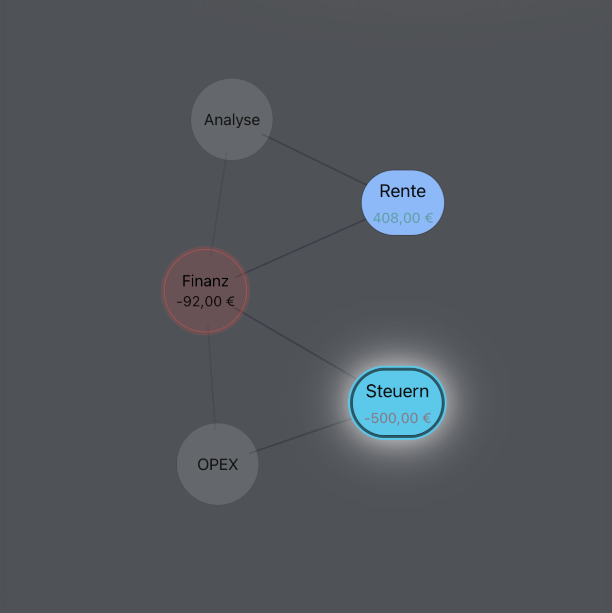

# Themenbasierter KPI-Rechner über Zeiträume

Interaktive Analyse von Kosten, Mengen, Erlösen und Ergebnissen über Jahre entlang **Quelle → Buchungstyp → Kategorie → wirtschaftliches Resultat** für Projektanalysen, Investitionsbewertungen, Kennzahlenvergleiche, Ergebnisorientierte Auswertungen

*Das gibt es alles schon so irgendwie*. Aber nicht so: **OLAP "light" für Menschen. 😎**



## Abgrenzung zu klassischen BI-Tools:

- ✔ Strukturdisziplin: Trennung von Quelle, Typ und Kategorie erzwingt konsistente Modellbildung.
- ✔ Transparente Wirklogik: Ökonomische Bewegungen sind nachvollziehbar – nicht nur aggregiert.
- ✔ Themenraum-Vergleich: CSV-Dateien können als getrennte oder gemeinsame Modellräume analysiert werden.
- ✔ Niedrige technische Einstiegshürde: Keine Datenbank, keine ETL-Strecke durch robustes CSV-Format.
- ✔ Explorative Validierung: Strukturvisualisierung für eigene Clusterprüfung und Modellkonsistenz.

## Datenmodell

<details>
<summary><strong>Mehrere universelle CSV‑Datenquellen</strong></summary>

- Mehrere generische CSV-Dateien bilden **Themenbereiche** ab. (z. B. Betrieb, Vermietung, Instandhaltung, Projekt X).
- Jede CSV ist paritätisch alles gleichzeitig: Datenquelle, semantischer Container und Deine eigene Analyse-Dimension ("= Quelle")

</details>

<details>
<summary><strong>Analytisches Raster</strong></summary>

Das vollständige Analysemodell lautet:

```
Quelle × Zeitraum × Kategorie × Buchungstyp
```

Die Quelle (CSV) ist ein gleichwertiger Filter- und Aggregations-Treiber  
(z. B. sichtbar in Legend, Filter und Aggregationen).

</details>

<details>
<summary><strong>Erwartete CSV-Struktur</strong></summary>

**Semikolon-separiert:**

```
Gegenpartei;Kostenart;Kategorie;Buchungstyp;Von;Bis;Jahr;Betrag;Menge;Einheit;Status;Memo
```

**Minimal erforderlich pro Datensatz:**
- Betrag
- Kategorie
- Buchungstyp
- mindestens eines der Datumsfelder: `Jahr` oder `Von/Bis`

Die CSV-Datei selbst wird automatisch als `Source` geführt  
(keine zusätzliche Spalte notwendig).

</details>

<details>
<summary><strong>Semantik: Eine CSV = ein Themenbereich</strong></summary>

Beispielhafte Struktur:

- `Betrieb.csv` → laufende Kosten
- `Vermietung.csv` → Einnahmen & Leerstand
- `Instandhaltung.csv` → Maßnahmen & Material
- `Projekt_X.csv` → Sonderlogik

Getrennte Pflege, aber übergreifende Analyse im UI möglich  
("Alle Quellen" vs. Einzelsource).

</details>

<details>
<summary><strong>Erweiterbarkeit</strong></summary>

Beliebige zusätzliche Spalten sind erlaubt.

Typische Nutzung:
- Single Source of Truth
- Vorstrukturierung in Tabellenkalkulation
- zusätzliche Dimensionen (Objekt, Vertrag, Konto, Steuer …)

Nicht benötigte Spalten werden ignoriert oder als Metadaten angezeigt.

</details>

<details>
<summary><strong>Systemwirkung</strong></summary>

Aus den CSV-Quellen entstehen automatisch:

**1. Interaktive Balkengrafik**  
Aggregation: `Quelle × Zeit × Kategorie × Typ`

**2. Force-Directed Network Graph**  
Visualisierung struktureller Beziehungen zwischen Kategorien, Typen und Quellen

</details>

## Perfekte Skalierung für optimale Erfahrung

- 150.000 CSV-Zeilen insgesamt (<= 20MB  Rohdaten)
- Pro Themenraum / CSV: <= 30 Kategorien, 10 Buchungstypen

Wenn es nicht reicht, sag Bescheid.

## Installation

```bash
cd app
npm install
npm start
# http://localhost:3044
```
